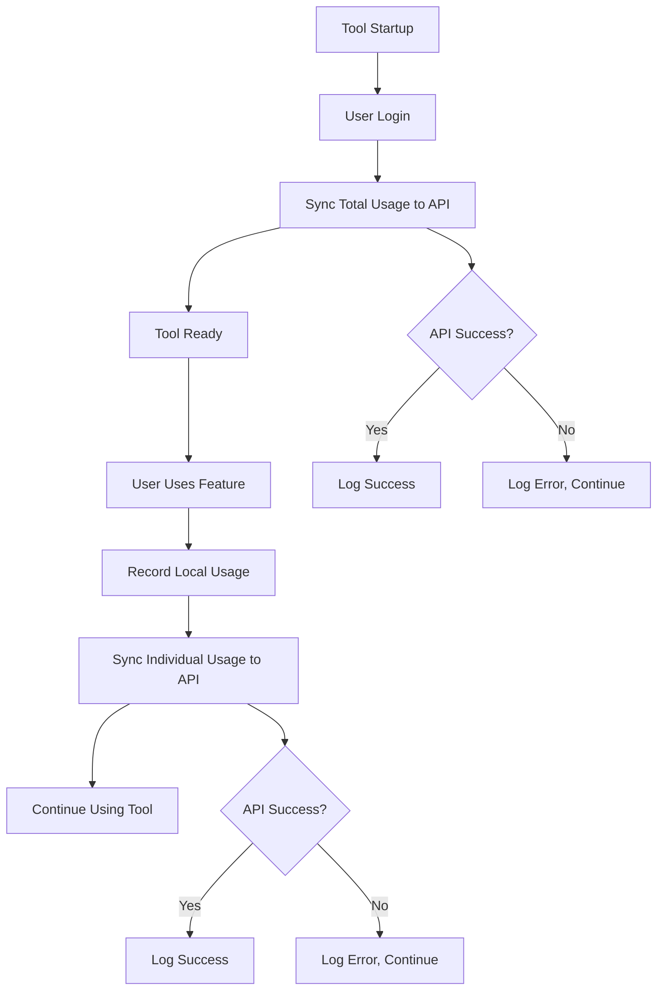

# 🔌 API Integration Setup Documentation

## 📋 Overview

JEG Design Extract v2.2.0 đã được tích hợp với API của hệ thống jegdn.com để gửi dữ liệu sử dụng tools lên server.

---

## 🚀 Features Implemented

### ✅ Auto Sync on Startup
- **Khi nào**: Mỗi lần mở tool và login thành công
- **Gửi gì**: Tổng số liệu sử dụng hiện tại của user
- **Background**: Chạy trong background thread, không block UI

### ✅ Real-time Usage Tracking  
- **Khi nào**: Mỗi lần user sử dụng tính năng (tạo ảnh/video)
- **Gửi gì**: Số lượng và chi phí của lần sử dụng đó
- **Background**: Chạy trong background thread

### ✅ Error Handling
- **Network errors**: Timeout, connection issues
- **API errors**: Invalid user, server errors
- **Fallback**: Local data vẫn được lưu nếu API fail

---

## 🔧 Technical Implementation

### API Endpoint
```
POST https://jegdn.com/api/tools/update
Content-Type: application/x-www-form-urlencoded
```

### Data Format
```python
{
    "userName": "lamdev",           # Username (required)
    "image_count": 5,               # Number of images processed
    "image_cost": "0.1015",        # Cost for image processing (string, 4 decimals)
    "video_count": 2,               # Number of videos generated  
    "video_cost": "12.80",         # Cost for video generation (string, 2 decimals)
    "total_cost": "12.9015",       # Total cost (string, 4 decimals)
    "timestamp": "2025-10-21 14:30:00"  # Timestamp
}
```

### 🎯 **Precision Guarantee**
- **Image costs**: Sent as strings with exactly **4 decimal places** (e.g., "0.1421")
- **Video costs**: Sent as strings with exactly **2 decimal places** (e.g., "12.80") 
- **Total costs**: Sent as strings with exactly **4 decimal places** (e.g., "12.9421")
- **No rounding**: Full precision preserved in all calculations
- **String format**: Prevents floating-point precision loss during transmission

### Code Integration Points

#### 1. UserManager Class
```python
# New API endpoint
self.api_endpoint = "https://jegdn.com/api/tools/update"

# Individual usage sync (called after each usage)
def _sync_usage_to_api(self, username, usage_type, count):
    # Sends individual usage data to API

# Total usage sync (called on startup)  
def sync_total_usage_to_api(self, username=None):
    # Sends complete usage statistics to API
```

#### 2. Main Application
```python
# Auto-sync on login
def show_login_dialog(self):
    if login_dialog.show():
        # ... login success
        threading.Thread(target=self._sync_usage_on_startup, daemon=True).start()

def _sync_usage_on_startup(self):
    # Calls user_manager.sync_total_usage_to_api()
```

#### 3. Usage Recording
```python
# Image processing
def record_image_usage(self, count=1):
    self.user_manager.record_image_usage(count=count)
    # -> Triggers _sync_usage_to_api() in background

# Video generation  
def record_video_usage(self, count=1):
    self.user_manager.record_video_usage(count=count)
    # -> Triggers _sync_usage_to_api() in background
```

---

## 📊 Data Flow



---

## 🧪 Testing

### Test Script
```bash
python3 test_api_integration.py
```

### Manual Testing
1. **Startup Sync**: 
   - Mở tool → Login → Check console logs
   - Kiểm tra data trên jegdn.com admin panel

2. **Usage Sync**:
   - Tạo ảnh/video → Check console logs  
   - Kiểm tra data trên jegdn.com admin panel

3. **Error Handling**:
   - Disconnect internet → Test offline behavior
   - Invalid username → Test error handling

---

## 📝 Console Logs

### Successful Sync
```
🔄 Syncing total usage to API for lamdev...
   Images: 5 ($0.1015)
   Videos: 2 ($12.80)
   Total: $12.9015
✅ Total usage synced successfully!
   Record ID: 123
```

### Individual Usage Sync
```
✅ Usage synced to API: lamdev - image x1 ($0.0203)
   Record ID: 124
```

### Error Cases
```
❌ API Error: User not found or not a seller
❌ Failed to sync usage to API: HTTP 500
❌ Error syncing usage to API: Connection timeout
```

---

## 🔍 Troubleshooting

### Common Issues

#### 1. "User not found or not a seller"
**Cause**: Username không tồn tại hoặc không có quyền seller
**Solution**: 
- Kiểm tra username có đúng không
- Đảm bảo user có `roles = 3` và `status = 1` trong database

#### 2. Connection Timeout
**Cause**: Network issues hoặc server slow
**Solution**:
- Kiểm tra internet connection
- Server có thể đang busy, thử lại sau

#### 3. "Failed to sync usage to API: HTTP 500"
**Cause**: Server internal error
**Solution**:
- Kiểm tra server logs
- Có thể là database issue hoặc API bug

#### 4. No API calls being made
**Cause**: User chưa login hoặc API endpoint sai
**Solution**:
- Đảm bảo user đã login thành công
- Kiểm tra API endpoint trong UserManager

### Debug Steps
1. **Check Console Logs**: Xem detailed error messages
2. **Test API Directly**: Dùng test script hoặc curl
3. **Check Network**: Ping jegdn.com
4. **Verify User**: Kiểm tra user trong database
5. **Check Server**: Xem server logs nếu có access

---

## 🔐 Security & Performance

### Security
- ✅ No sensitive data in API calls
- ✅ HTTPS encryption
- ✅ No authentication tokens (username-based)
- ✅ Input validation on server side

### Performance  
- ✅ Background threading (không block UI)
- ✅ Timeout handling (10-15 seconds)
- ✅ Error graceful handling
- ✅ Local data preserved if API fails

### Rate Limiting
- **Current**: No rate limiting
- **Recommendation**: Don't spam API, reasonable usage only

---

## 📈 Monitoring

### What to Monitor
1. **API Success Rate**: % of successful API calls
2. **Response Times**: Average API response time
3. **Error Types**: Most common error messages
4. **User Activity**: Which users are most active

### Server Side Logs
```
[2025-10-21 14:30:00] Tools usage logged via API: {
  "userName": "lamdev",
  "user_id": 24,
  "record_id": 123,
  "ip": "192.168.1.100"
}
```

---

## 🚀 Future Enhancements

### Planned Features
- **Batch Sync**: Send multiple usage records in one call
- **Retry Logic**: Auto-retry failed API calls
- **Offline Queue**: Queue API calls when offline
- **Real-time Dashboard**: Live usage monitoring
- **Usage Analytics**: Advanced reporting features

### API Improvements
- **Authentication**: Add API keys for security
- **Rate Limiting**: Implement proper rate limiting
- **Webhooks**: Real-time notifications
- **GraphQL**: More flexible data queries

---

## 📞 Support

### Contact Information
- **Developer**: Lam Nguyen  
- **System**: jegdn.com
- **Environment**: Production
- **API Documentation**: See API_TOOLS_USAGE_DOCUMENTATION.md

### Getting Help
1. Check console logs for detailed errors
2. Run test script: `python3 test_api_integration.py`
3. Contact system administrator
4. Check server status at jegdn.com

---

## 📝 Changelog

### v1.0 (2025-10-21)
- ✅ Initial API integration
- ✅ Auto-sync on startup
- ✅ Real-time usage tracking
- ✅ Background threading
- ✅ Error handling
- ✅ Comprehensive logging
- ✅ Test scripts included

---

## 🎯 Success Criteria

### ✅ Integration Complete When:
- [x] Tool sends total usage on startup
- [x] Tool sends individual usage after each action
- [x] API calls work in background (no UI blocking)
- [x] Errors are handled gracefully
- [x] Local data is preserved regardless of API status
- [x] Console logs provide clear feedback
- [x] Test scripts pass successfully

**🎉 API Integration is now complete and ready for production use!**
